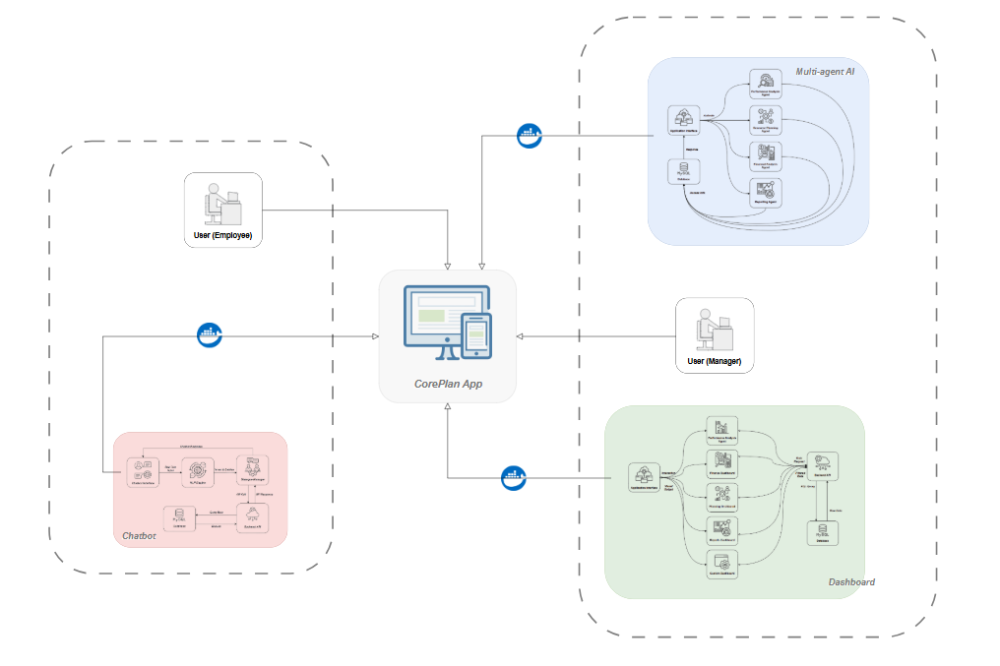
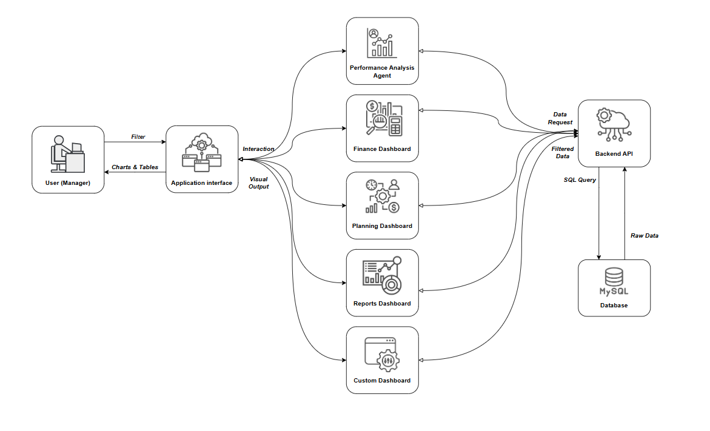
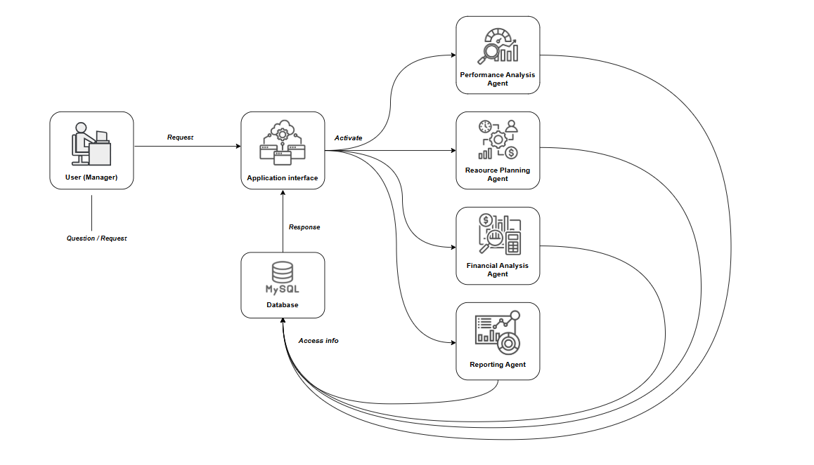
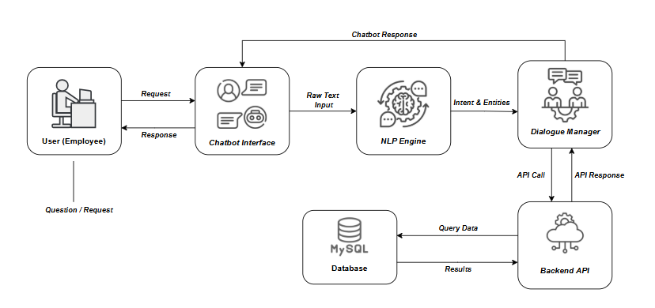

# CorePlanAPP

CorePlanAPP is a dissertation project that implements an integrated system for financial planning and resource management within organizations.  
The application is designed as a modular platform that combines dashboards, AI-based analysis, and a multi-agent architecture.

## 🎯 Objective

The goal of the project is to provide a scalable and modular solution for managing financial and organizational resources in small and medium-sized enterprises.

## 🧩 System Architecture

The system is built using a modular architecture, where each component runs independently and is orchestrated using Docker.

### 📌 High-Level Architecture

## 🧠 Core Components

### 📊 Dashboard (Manager Interface)
- Designed for managers
- Provides visual insights through charts and reports
- Includes financial analysis, planning, and performance monitoring

### 🤖 Assistix (Multi-Agent System)
- AI-based decision support system
- Uses multiple agents:
  - Performance Analysis Agent
  - Financial Analysis Agent
  - Resource Planning Agent
  - Reporting Agent

### 💬 Taskly (Chatbot for Employees)
- Designed for employees
- Provides a conversational interface for interacting with the system
- Uses NLP and backend APIs

## 🐳 Docker & Modularity

The application is containerized using Docker in order to:
- ensure modular deployment
- allow independent scaling of components
- simplify integration between services

Each module runs independently and communicates through APIs.

## 🚀 Running the Application

### 🔹 Assistix (Multi-Agent System)

cd coreplan_agents_assistix/CorePlanAssistix  
docker compose up --build

### 🔹 Dashboard (Manager Interface)

cd coreplan_visual_dashboard/pythonProject  
docker build -t coreplan-dashboard .  
docker run -p 8050:8050 coreplan-dashboard  

Access the dashboard at:  
http://localhost:8050

### 🔹 Taskly (Chatbot for Employees)

cd coreplan_chatbot_taskly/pythonProject  

## 🐳 Alternative: Run Full System with Docker

docker compose up --build

## 🎬 Demo

The full demo is also available in:  
demo/Demo.mkv

## 📸 Screenshots & Diagrams

All architecture diagrams and visual materials are available in:  

images/

## 🔐 Future Improvements

- Real-time alert system for budget and performance deviations  
- Integration with HR and project management systems  
- Collaborative reporting system  
- Advanced security (encryption, 2FA, activity logs)  

## 🎓 Academic Context

This project was developed as part of a dissertation:

Integrated System for Financial Planning and Resource Management in Organizations

## 🧠 Key Concepts Demonstrated

- Modular system design  
- Multi-agent systems  
- AI-based decision support  
- Data visualization dashboards  
- Containerization with Docker  
